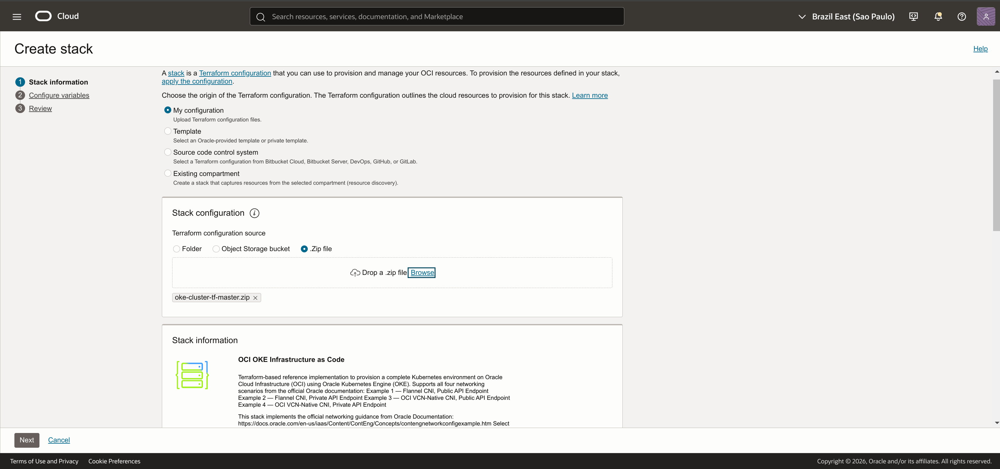
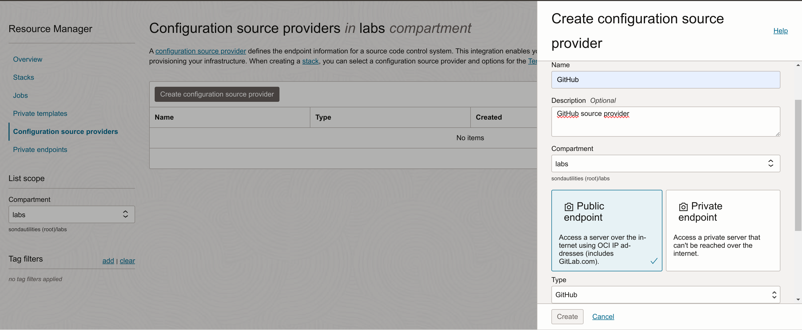
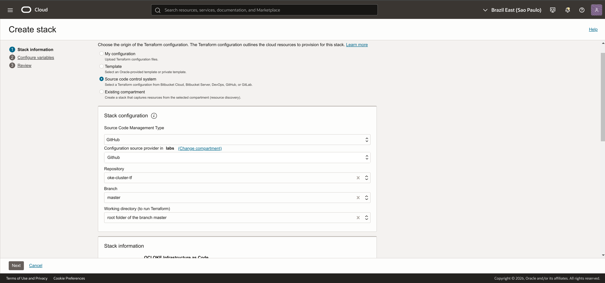
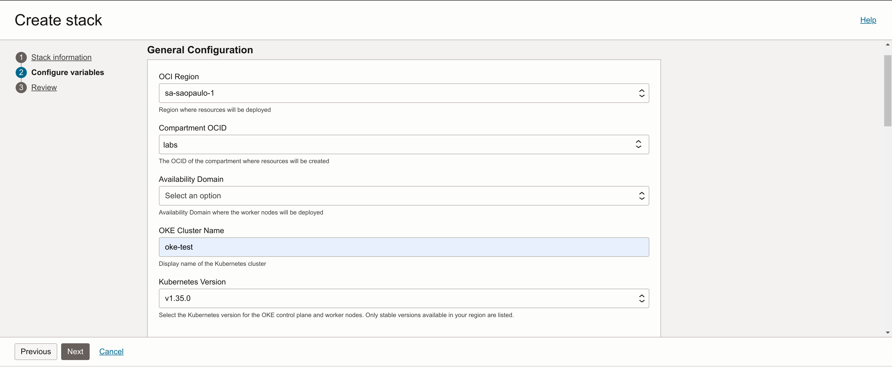
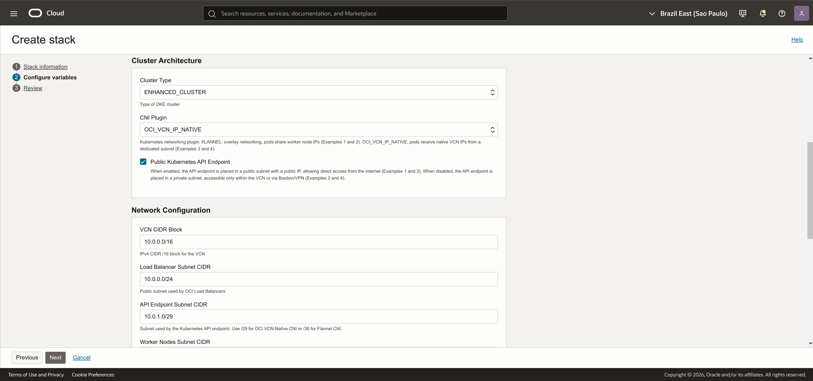
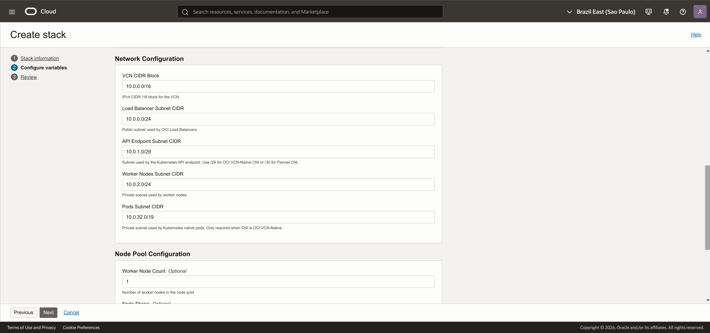
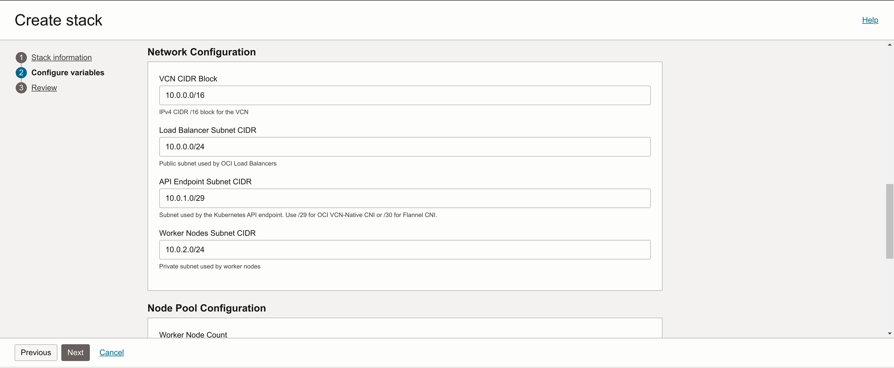
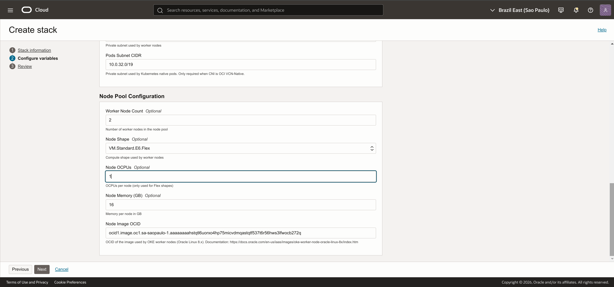
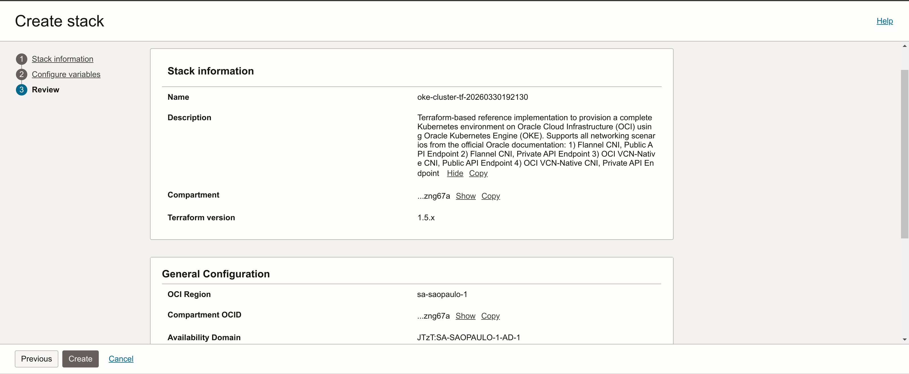

# OKE Cluster Deployment with OCI Resource Manager

This guide walks through the end-to-end process of deploying an OKE cluster using this Terraform repository and OCI Resource Manager (ORM). The stack supports all four networking scenarios from the official Oracle documentation — the desired scenario is selected directly in the ORM Console form.

---

## Prerequisites

### OCI Requirements

- An OCI tenancy with an active subscription
- A compartment where resources will be created
- IAM policies granting the deploying user (or group) permissions to manage VCNs, subnets, gateways, OKE clusters, and node pools in the target compartment
- At least one Availability Domain available in the target region

### Required information before starting

- **Compartment OCID** — the target compartment for all resources
- **Worker Node Image OCID** — the OKE-compatible image for your region and Kubernetes version. Consult the [OKE Worker Node Images](https://docs.oracle.com/en-us/iaas/images/oke-worker-node-oracle-linux-8x/index.htm) documentation
- **Networking scenario** — decide which combination of CNI plugin and API endpoint exposure you need:

| Scenario | `cni_type` | `is_api_endpoint_public` |
|----------|-----------|--------------------------|
| Example 1 — Flannel, Public API | `FLANNEL` | `true` |
| Example 2 — Flannel, Private API | `FLANNEL` | `false` |
| Example 3 — OCI VCN-Native, Public API | `OCI_VCN_IP_NATIVE` | `true` |
| Example 4 — OCI VCN-Native, Private API | `OCI_VCN_IP_NATIVE` | `false` |

### Local requirements (for post-deployment verification)

- `kubectl` installed
- OCI CLI installed and configured (or use OCI Cloud Shell)

---

## Step 1 — Create the Stack

OCI Resource Manager supports multiple ways to import Terraform configurations. Choose the option that best fits your workflow.

### Option A — From a ZIP file

This is the simplest approach — no GitHub integration required.

1. Go to the GitHub repository page and click **Code → Download ZIP**.
2. In the OCI Console, navigate to **Developer Services → Resource Manager → Stacks**.
3. Click **Create Stack**.
4. Select **My Configuration** as the origin.
5. Choose **ZIP File** and upload the file downloaded in step 1.
6. Click **Next**.



### Option B — From a GitHub Source Provider

This option connects ORM directly to the GitHub repository, enabling automatic updates when the code changes.

**1. Create a Source Provider (one-time setup)**

If you have already configured a GitHub Source Provider, skip to the next sub-step.

1. In the OCI Console, navigate to **Developer Services → Resource Manager → Configuration Source Providers**.
2. Click **Create Configuration Source Provider**.
3. Select **GitHub** as the type.
4. Authenticate with your GitHub account and grant access to the repository.



**2. Create the Stack from the Source Provider**

1. Navigate to **Developer Services → Resource Manager → Stacks**.
2. Click **Create Stack**.
3. Select **Source Code Control System** as the origin.
4. Configure:
    - **Source Provider:** the GitHub provider created above
    - **Repository:** `oke-cluster-tf`
    - **Branch:** `main`
    - **Working Directory:** `/`
5. Click **Next**.



---

Regardless of the option chosen, the ORM Console will parse the `schema.yaml` file and render a guided form for the stack variables, as described in the next step.

---

## Step 2 — Configure Stack Variables

This is where the `schema.yaml` enhances the ORM experience. Instead of manually filling in raw Terraform variable values, the console presents organized form sections with contextual descriptions, dynamic dropdowns, and conditional visibility.

### 2.1 — General Configuration

This section includes region, compartment, availability domain, cluster name, and Kubernetes version. The compartment and availability domain fields use native OCI lookups — you select from a dropdown populated by your tenancy, instead of pasting OCIDs manually.



### 2.2 — Cluster Architecture

This section controls the networking scenario. Three fields determine the cluster topology:

- **Cluster Type** — `BASIC_CLUSTER` or `ENHANCED_CLUSTER`
- **CNI Plugin** — `OCI_VCN_IP_NATIVE` or `FLANNEL`
- **Public Kubernetes API Endpoint** — checkbox (enabled = public, disabled = private)

The combination of **CNI Plugin** and **Public Kubernetes API Endpoint** maps directly to one of the four Oracle documentation examples. All downstream resources (subnets, route tables, security lists) are automatically adjusted.



### 2.3 — Network Configuration

This section shows the CIDR blocks for each subnet. The key behavior here is **conditional visibility**: the **Pods Subnet CIDR** field only appears when the CNI plugin is set to `OCI_VCN_IP_NATIVE`. When `FLANNEL` is selected, the field is hidden because Flannel does not require a dedicated pods subnet.





This conditional behavior is defined in the `schema.yaml` using the `visible` property:

```yaml
subnet_pods_cidr_19:
  type: string
  title: "Pods Subnet CIDR"
  visible: ${cni_type == "OCI_VCN_IP_NATIVE"}
```

For details on schema customization, see the [ORM Schema Documentation](https://docs.oracle.com/en-us/iaas/Content/ResourceManager/Concepts/terraformconfigresourcemanager_topic-schema.htm).

### 2.4 — Node Pool Configuration

This section configures the compute resources: worker node count, shape, OCPUs, memory, and the node image OCID.



After filling in all sections, click **Next** to review, then **Create** to save the stack.

---

## Step 3 — Review the Stack

After creation, the stack overview shows the selected configuration and the informational text from the `schema.yaml`, which identifies the implemented reference architecture.



---

## Step 4 — Run Terraform Plan

The Plan action previews all resources that will be created without making any changes.

1. On the stack page, click **Terraform Actions → Plan**.
2. Wait for the job to complete.
3. Review the plan output.

The number of resources varies by scenario:

| Scenario | Expected resources                                                                     |
|----------|----------------------------------------------------------------------------------------|
| Flannel (Examples 1, 2) | ~14 resources (no pods subnet, no pods security list, no service-only route table)     |
| VCN-Native (Examples 3, 4) | ~17 resources (includes pods subnet, pods security list, and service-only route table) |


---

## Step 5 — Apply the Configuration

After reviewing the plan:

1. Click **Terraform Actions → Apply**.
2. Confirm the action.
3. Wait for the job to complete. Typical provisioning time is 10–15 minutes.

<!-- SCREENSHOT: apply-in-progress.png -->
<!-- Caption: Apply job in progress — ORM provisions all networking resources, the OKE cluster, and the node pool. -->

<!-- SCREENSHOT: apply-completed.png -->
<!-- Caption: Apply job completed successfully — all resources created. -->

### Reviewing Outputs

After the apply completes, the **Outputs** tab shows the values defined in `outputs.tf`, including the `scenario_description` that confirms which Oracle documentation example was provisioned.

<!-- SCREENSHOT: apply-outputs.png -->
<!-- Caption: Stack outputs — the scenario_description confirms the selected networking scenario (e.g., "Example 3 — OCI VCN-Native CNI, Public Kubernetes API Endpoint"). -->

---

## Step 6 — Verify the OKE Cluster

1. Navigate to **Developer Services → Kubernetes Clusters (OKE)**.
2. Verify that the cluster status is **ACTIVE**.
3. Check the node pool and confirm the worker nodes are in **ACTIVE** state.

<!-- SCREENSHOT: oke-cluster-active.png -->
<!-- Caption: OKE cluster in ACTIVE state in the OCI Console. -->

<!-- SCREENSHOT: oke-node-pool-active.png -->
<!-- Caption: Node pool details showing active worker nodes. -->

### Verifying the Network Topology

Navigate to **Networking → Virtual Cloud Networks** and inspect the VCN created by the stack. Verify that:

- The subnets match the expected scenario (3 subnets for Flannel, 4 for VCN-Native)
- The route tables are correctly assigned (public vs. private, service-only for VCN-Native workers)
- The security lists contain the expected rules

<!-- SCREENSHOT: vcn-subnets-overview.png -->
<!-- Caption: VCN subnets created by the stack — showing the subnet visibility (public/private) and associated route tables. -->

---

## Step 7 — Connect to the Cluster

### Using OCI Cloud Shell

Open the cluster details page and click **Access Cluster → Cloud Shell Access**. Run the provided command:

```bash
oci ce cluster create-kubeconfig \
  --cluster-id <cluster_ocid> \
  --file $HOME/.kube/config \
  --region <region> \
  --token-version 2.0.0
```

Verify connectivity:

```bash
kubectl get nodes
```

Expected output: worker nodes in `Ready` status.

<!-- SCREENSHOT: cloud-shell-kubectl.png -->
<!-- Caption: Cloud Shell session showing successful kubectl connection and worker nodes in Ready status. -->

> **Note:** If the API endpoint is private (Examples 2 and 4), Cloud Shell access requires that the Cloud Shell network can reach the private endpoint. You may need to use OCI Bastion, VPN, or FastConnect instead.

---

## Step 8 — Deploy a Sample Application (Optional)

Deploy a sample application to validate the cluster:

```bash
kubectl create deployment sample-app --image=nginx
kubectl expose deployment sample-app --type=LoadBalancer --port=80
```

Wait for the load balancer to be provisioned:

```bash
kubectl get services -w
```

Once the `EXTERNAL-IP` is assigned, access the application in your browser.

---

## Step 9 — Destroy Infrastructure

When the environment is no longer needed:

1. Navigate to **Resource Manager → Stacks**.
2. Select the stack.
3. Click **Terraform Actions → Destroy**.
4. Confirm the action.

All resources created by the stack will be removed.

<!-- SCREENSHOT: destroy-completed.png -->
<!-- Caption: Destroy job completed — all resources removed. -->

---

## Schema.yaml — Extending the ORM Console Experience

The `schema.yaml` file is what transforms the ORM deployment from a raw variable form into a guided, context-aware experience. Key features used in this stack:

**Variable grouping** — variables are organized into logical sections (General, Cluster Architecture, Network, Node Pool) instead of being presented as a flat list.

**OCI-native types** — fields like `compartment_id` and `ad_name` use OCI-specific types (`oci:identity:compartment:id`, `oci:identity:availabilitydomain:name`) that render as dynamic dropdowns populated from the tenancy.

**Conditional visibility** — the Pods Subnet CIDR field is hidden when Flannel is selected, reducing visual noise and preventing configuration errors.

**Validation patterns** — CIDR fields use regex patterns to prevent malformed input.

**Contextual descriptions** — each field includes a description that explains its purpose and constraints.

For full documentation on schema capabilities, see the [ORM Schema Reference](https://docs.oracle.com/en-us/iaas/Content/ResourceManager/Concepts/terraformconfigresourcemanager_topic-schema.htm).